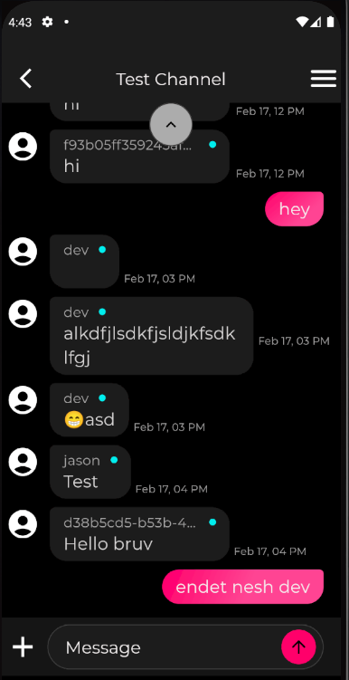

## Installation

1. Clone the repository.
   ```bash
   git clone https://github.com/leulabay1/sendbird.git
   ```

2. Install dependencies.
   ```bash
   flutter pub get
   ```
2. Run the project.
   ```bash
   flutter run
   ```

## Screenshots


```bash


```


